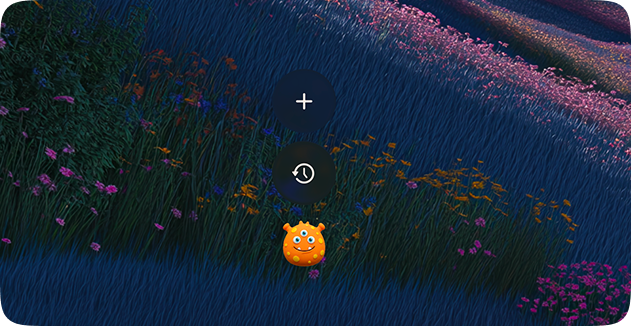

# Bobble

Bobble is a playful macOS app for working with AI agents through floating chat heads.

Bobble gives each conversation its own draggable bubble, expandable chat window, local workspace, and quick access from the menu bar.

## What it does

- Lives in the menu bar with a floating, always-available chat surface
- Creates one chat head per session so you can keep multiple agent conversations alive at once
- Supports multiple CLI backends: `codex`, `copilot`, `claude`
- Lets you switch providers from the menu bar
- Streams assistant output into the chat window
- Supports file attachments, image drops, and screenshot capture
- Stores each chat in its own local workspace directory
- Persists active and archived chat history between launches
- Shows lightweight provider usage info in the menu bar

## Why Bobble

Bobble is meant to make agent workflows feel lighter and more visual:

- fast to open
- easy to keep around while working
- better suited for parallel conversations
- more fun than bouncing between terminal windows

## Requirements

- macOS 14.0+
- Xcode with Swift support

## Dependencies

Bobble is the app layer for your agent workflow. To use it properly, you should already have at least one of these available on your Mac:

- Codex
- Claude Code
- VS Code with your AI tooling set up

For the current implementation, Bobble talks to installed agent tools through these command names:

- `codex`
- `claude`
- `copilot`

Bobble also probes common install locations such as `/opt/homebrew/bin`, `/usr/local/bin`, `~/.local/bin`, `~/.volta/bin`, and `~/.cargo/bin`, which helps it find installed agent tools reliably.

## Getting started

1. Make sure Codex, Claude Code, or VS Code with your preferred AI tooling is already installed and authenticated.
2. Open [`Bobble.xcodeproj`](./Bobble.xcodeproj) in Xcode.
3. Build and run the `Bobble` app target.
4. Look for the speech bubble icon in the macOS menu bar.
5. Create a new chat and start talking to your agent.

## Using the app

- Click the menu bar icon to choose the active provider and inspect usage.
- Press `+` to create a new chat head.
- Click a chat head to expand it into a full chat window.
- Drag files or images into a chat, or use the paperclip button.
- Use the screenshot button to capture part of the screen as an attachment.
- Archive chats you want to keep without leaving them in the active stack.
- Reopen archived chats from the history popover.

On the first user message, Bobble also tries to pick a matching emoji for that chat head automatically.

## Permissions

If you use screenshot capture, Bobble needs macOS Screen Recording permission.

If you just enabled that permission in System Settings, quit and reopen the app before trying again.

## Storage

Bobble stores data in the user Application Support directory:

- Session history: `~/Library/Application Support/Bobble/session-history.json`
- Per-chat workspaces: `~/Library/Application Support/Bobble/ChatWorkspaces/<session-id>/`
- Session attachments: `~/Library/Application Support/Bobble/ChatWorkspaces/<session-id>/attachments/`

Each session workspace is used as the working directory for the underlying CLI process, so attached files and generated artifacts can stay scoped to that conversation.

## Project structure

- [`Bobble/BobbleApp.swift`](./Bobble/BobbleApp.swift)
  App entry point
- [`Bobble/AppDelegate.swift`](./Bobble/AppDelegate.swift)
  Menu bar setup, floating panel lifecycle, window behavior, and usage menu
- [`Bobble/ViewModels/ChatHeadsManager.swift`](./Bobble/ViewModels/ChatHeadsManager.swift)
  Session orchestration, persistence, history, and provider coordination
- [`Bobble/ViewModels/ChatSessionViewModel.swift`](./Bobble/ViewModels/ChatSessionViewModel.swift)
  Per-chat interaction logic, sending prompts, attachments, and screenshot capture
- [`Bobble/Process/CLIProcessManager.swift`](./Bobble/Process/CLIProcessManager.swift)
  Launches and manages backend CLI processes
- [`Bobble/Process/StreamParser.swift`](./Bobble/Process/StreamParser.swift)
  Parses streaming output from supported backends
- [`Bobble/Views/`](./Bobble/Views)
  Chat heads, chat window, message bubbles, and input UI

## Notes

- Bobble is a menu bar app (`LSUIElement`), so it does not appear as a normal Dock app.
- Codex sessions support model selection directly in the input bar.
- History includes both active and archived sessions, ordered by recent activity.

## Status

This project is an actively evolving prototype for making AI agent workflows feel more ambient, visual, and enjoyable on macOS.
